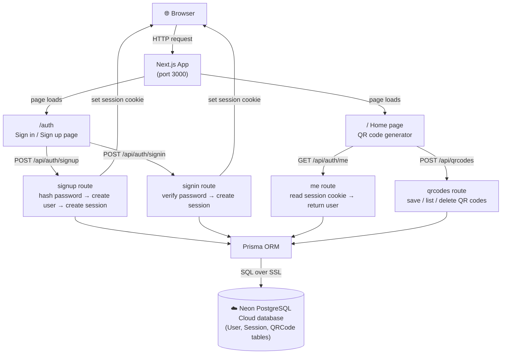
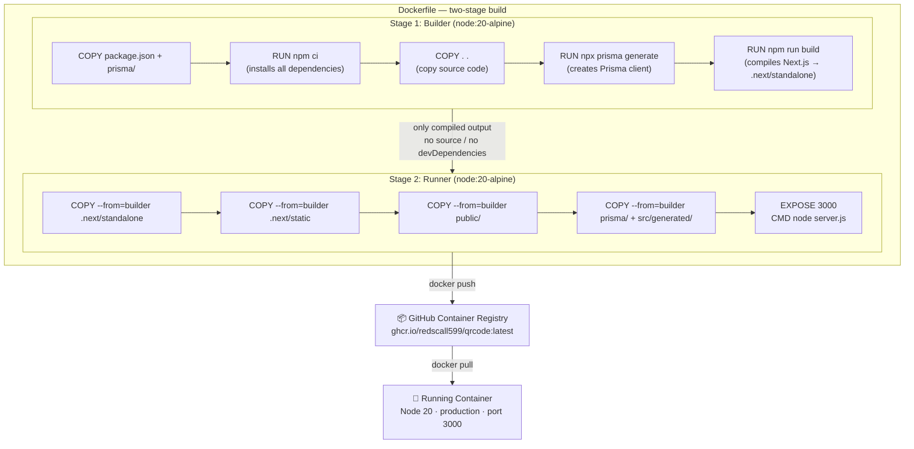
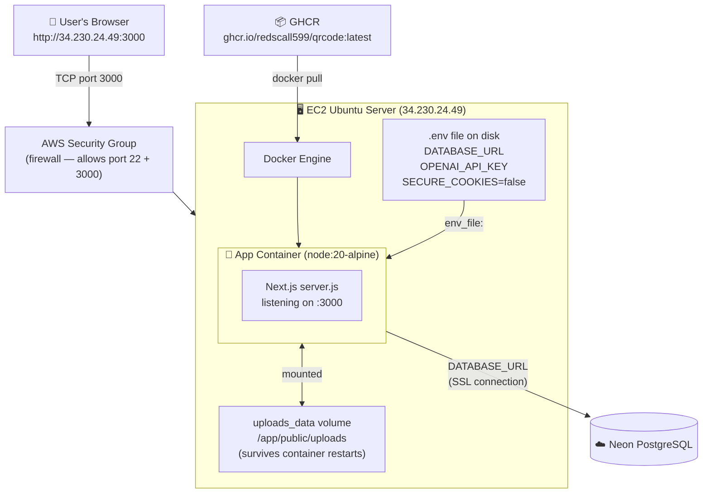
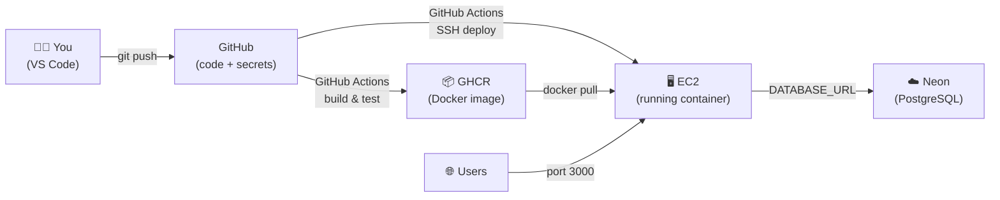

# Architecture Overview

Visual diagrams of how each piece of the project works.

---

## 1. How the App Works

A user opens the browser and everything flows through Next.js:

---

## 2. How Docker Works

Docker packages your app into a portable image using two stages:

**Why two stages?** The builder stage needs hundreds of MB of dev tools that are useless at runtime. The runner stage copies only the compiled output — making the final image 3–5× smaller.

---

## 3. How EC2 Works

EC2 is just a Linux server running Docker. Your app lives inside a container:

---

## 4. How the CI/CD Pipeline Works

Every `git push` to `main` triggers two automatic jobs in GitHub Actions:

```mermaid
flowchart TD
    Push["git push → main branch"]

    Push --> GHA["⚙️ GitHub Actions triggered\n(.github/workflows/ci.yml)"]

    GHA --> Job1

    subgraph Job1["Job 1: build-and-test  (runs on GitHub's servers)"]
        direction TB
        J1A["actions/checkout@v4\n(download repo)"]
        J1B["docker/setup-buildx-action\n(enable layer caching)"]
        J1C["docker/login-action\n(login to GHCR)"]
        J1D["docker/build-push-action\n(build Dockerfile → push image to GHCR)"]
        J1E["docker compose pull app\n(pull image for testing)"]
        J1F["echo secrets > .env\n(write DATABASE_URL etc.)"]
        J1G["docker compose up -d\n(start container)"]
        J1H["sleep 15\n(wait for app to boot)"]
        J1I["docker compose exec app\nnpx prisma migrate deploy\n(apply DB migrations)"]
        J1J["docker compose exec app\nnpm test\n(run test suite)"]
        J1K["docker compose down -v\n(tear down)"]

        J1A --> J1B --> J1C --> J1D --> J1E --> J1F --> J1G --> J1H --> J1I --> J1J --> J1K
    end

    Job1 -->|"✅ tests passed"| Job2

    subgraph Job2["Job 2: deploy  (runs commands ON your EC2 over SSH)"]
        direction TB
        J2A["appleboy/ssh-action\nSSH into 34.230.24.49"]
        J2B["git pull origin main\n(update docker-compose.yml etc.)"]
        J2C["docker pull ghcr.io/redscall599/qrcode:latest\n(download new image)"]
        J2D["docker compose down\n(stop old version)"]
        J2E["echo secrets > .env\n(write env file on EC2)"]
        J2F["docker compose run --rm app\nnpx prisma migrate deploy\n(apply migrations)"]
        J2G["docker compose up -d\n(start new version)"]
        J2H["wait for healthcheck ✅\nthen docker image prune -f"]

        J2A --> J2B --> J2C --> J2D --> J2E --> J2F --> J2G --> J2H
    end

    Job2 --> Live["🌐 App live at\nhttp://34.230.24.49:3000"]
```

---

## All Together

